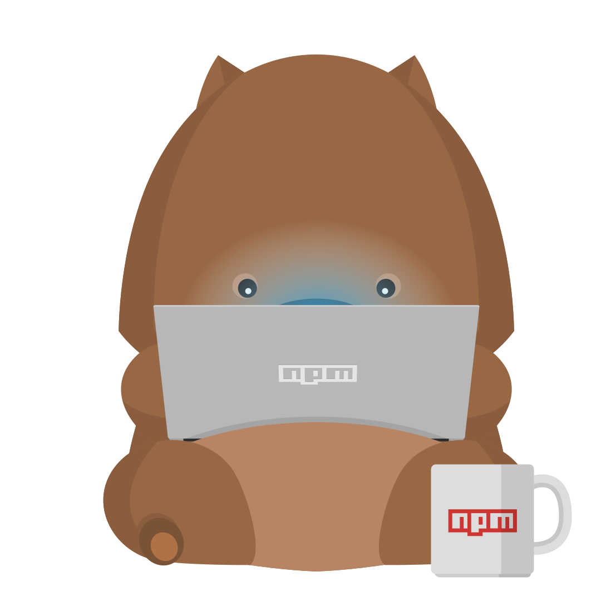
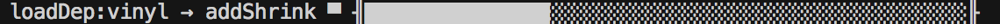
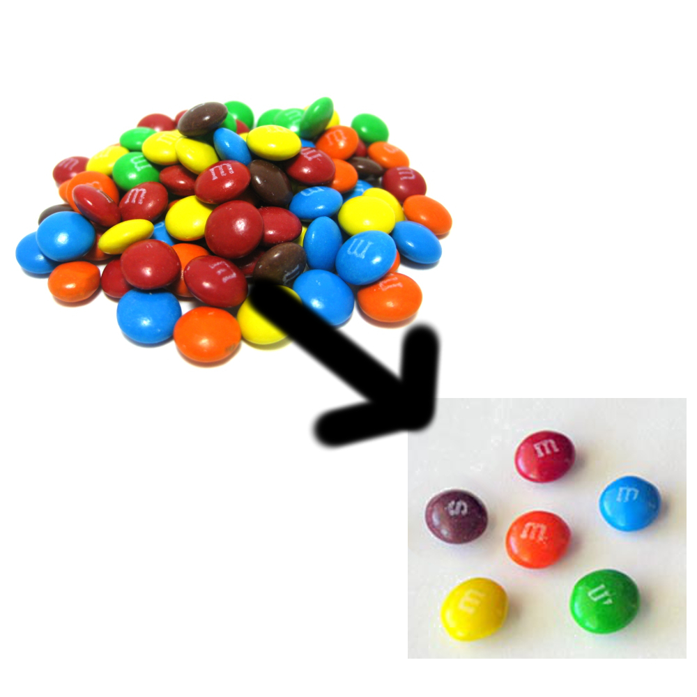
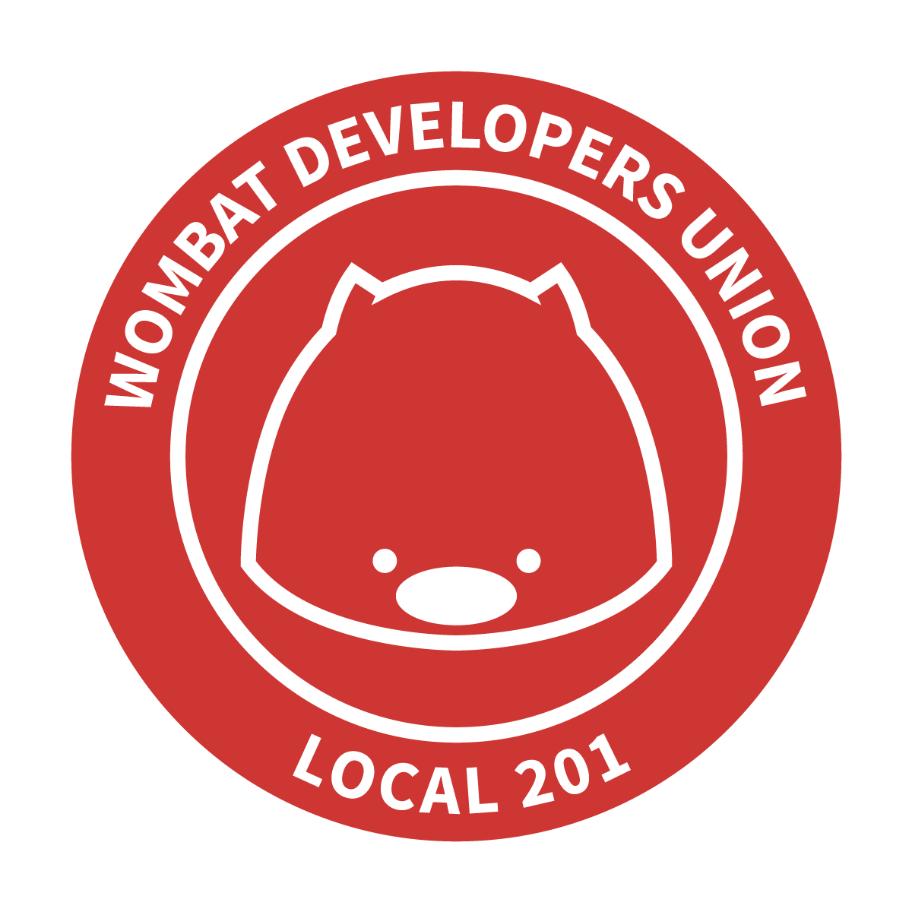

# Where I put your cheese

## Or what to expect from npm@3


---



## Rebecca Turner

### Engineer at
### 

### @ReBeccaOrg
### Github: iarna

^ Hi, I'm Rebecca Turner and I work for npm.

^ Specificaly I work on the `npm` command line tool with Forest Norvell.

^ Recently, I've been rewriting how npm installs modules.

^ If you have any questions, please ask as we go along.

---


## npm@3

* Interface Improvements

* Flat (mostly) node\_modules

* Validate before we start

* Breaking Changes

^ There have been a lot of changes in npm@3

^ It's probably the single largest release that we've done, which is good and bad. We're really execited about the improvements and bug fixes that we're bringing, but it's a bigger bang then we'd have liked.

---


## Progress bar!



^ The first thing that you're likely to notice with the new npm is the addition of a progress bar. 

^ Gone are the days of having to watch npm spin with no sense of how long you'll be there.

^ On a large project, this can be a substantial amount of time and having no indication that npm is actually working is frustrating.

---


^ So what you see here is it installing `socket.io`. A major part of this rewrite was to split the install into descrete stages, each of which has to finish before the next stage is started. At the start you can see it resolving dependency information. Then it quickly fetches and extracts them. And finally you'll see it running all of the lifecycle scripts. This staging should eliminate many race conditions we've seen around lifecycle scripts.

---


## Earlier error reporting

^ Due to the staging we're now able to report errors earlier, often before any changes to your node\_modules folder have taken place.

^ Relatedly, we're nowing deferring warnings whenever possible to the end, so they're visible on the screen when the install is done.

---


## Better shrinkwrap support

^ Shrinkwrap is npm's answer to the Ruby gems lockfile.

^ npm@3 will make shrinkwraps a little easier to always have present. When you run install or rm with `--save` it will save the changes to your shrinkwrap in addition to your package.json.

---


## Dry run support
## `npm install --dry-run`

^ We're adding support for a dry-run option that will let you see what a command would do without making any local changes. This applies to all of the things that change your node_modules: install, uninstall, update, dedupe

---

## Flat (mostly) node\_modules


^ So, after you're done being dazzled by the fancy new progress bar the next thing you are going to notice is that your node\_modules is mostly flat.  By this I mean, all your dependencies and most of your subdependencies and subsubdependencies will be sitting next to each other in your top level node\_modules.

^ In practice, how does this look? Well, let's compare before and after…

---

## npm@2 Dependencies


```
$ npm -v
2.5.1
$ npm install optimist
optimist@0.6.1 node_modules/optimist
├── wordwrap@0.0.2
└── minimist@0.0.10
$ ls -l node_modules/
total 0
drwxr-xr-x 10 rebecca staff 340 Feb  9 05:02 optimist
$ npm ls
/Users/rebecca/presentation
└─┬ optimist@0.6.1
  ├── minimist@0.0.10
  └── wordwrap@0.0.2
 
 
```

^ In npm@2 you see we installed `optimist` and it's the only thing directly in our node\_modules.  It's dependencies, `minimist` and `wordwrap` have been installed in `optimist`'s node\_modules.

---

## npm@3 Dependencies


```
$ npm -v
3.0.0
$ npm install optimist
optimist@0.6.1 node_modules/optimist
wordwrap@0.0.2 node_modules/wordwrap
minimist@0.0.10 node_modules/minimist
$ ls -l node_modules/
total 0
drwxr-xr-x 9 rebecca staff 306 Feb  9 04:59 minimist
drwxr-xr-x 9 rebecca staff 306 Feb  9 04:59 optimist
drwxr-xr-x 8 rebecca staff 272 Feb  9 04:59 wordwrap
$ npm ls
/Users/rebecca/presentation
└─┬ optimist@0.6.1
  ├── minimist@0.0.10
  └── wordwrap@0.0.2
```

^ Now, by contrast, with npm@3 your modules directory has all of `optimist`'s dependencies.

^ You can also see that `npm ls` still gives you the logical tree layout that you're already familiar with.

---


## npm@3 `npm rm` still removes subdeps

```
$ npm rm optimist
unbuild optimist@0.6.1
$ npm ls
/Users/rebecca/presentation
└── (empty)
```

^ And if we remove the top level module, its dependencies are also removed, as they are today.

---


## npm@3 version conflicts

```
$ npm install minimist
minimist@1.1.0 node_modules/minimist
$ npm install optimist
wordwrap@0.0.2 node_modules/wordwrap
optimist@0.6.1 node_modules/optimist
└── minimist@0.0.10
$u ls node_modules/
minimist  optimist  wordwrap
$ ls node_modules/optimist/node_modules/
minimist
```

^ In the case of conflicts, we still resolve them the same way, by installing the conflicting module deeper in the tree.

---

## But why?


^ But you may be wondering, why would we want things to be flat? One word:

---


## Windows


^ Windows.

^ Many windows tools have a path length limit that node often runs into due to it's deeply nested node\_modules folders.

^ This path length limit does not cause problems for node or other tools that use recent windows APIs.

^ But it does effect all sorts of critical windows administration tools from explorer to cmd.exe.

^ This can make it impossible to remove project paths without getting special tools.

---


## Windows


`npm install -g rimraf`

^ Specifically, rimraf is written in only node and so does not have this limit.

^ By making node\_modules as flat as possible, we expect to keep paths short enough to no longer hit this limit most of the time.

---


## Deduplication



^ But that's not the only benefit, the other is much more aggressive deduplication, so your node\_modules folder can be smaller and will take less time to download and install.

^ Because deduplication will now happen as a part of module installation, it can be done prior to downloading anything.

---

## Breaking Changes


^ Alright, now lets talk about the breaking changes. Why is this npm@3? Sure, the flat node\_modules folder is a big change, but it shouldn't break anything. Well…

---

## Breaking Changes


### peerDepencencies

* No longer cause anything to be installed.
* Warn when they aren't met

^ In npm@2 we've tried to install the peerDependency at a level above the module with the dependency. When there are version conflicts this almost always results in doing the wrong thing.

^ So peerDependencies are changing– they now produce a warning if nothing else has installed a version of the dependency they need.

---

## Breaking Changes


### engineStrict

* No longer means anything when in the `package.json`
* No change to semantics when its added to your `.npmrc`

^ `engineStrict`, as a `package.json` attribute, is going away. We feel this is something application authors should control, not library authors.

^ You'll still be able to specify it on the command line or in your `.npmrc`

---


## Hosted Git Support

* `npm i user/project` has installed from github for a long time. It still will.
* Not just for github any more:
  * `npm i gitlab:user/project bitbucket:user/project gist:user/gistid github:user/project`
* Easy to add more

### Already here! Backported a month or two ago.

^ I'm not keen on blessing one vendor above another. We currently give both `git` and `github` a special place, but that's something I'd like to change.

^ The first step in this is adding support for shortcuts for other hosted git providers and making it easier to add more.

^ Having support means more than just a shortcuts installing modules. It means `npm docs` and `npm bugs` can correctly guess the right URLs from just a repository.


---


## Coming Soon

* npm@3 will be here before you know it.

* Roadmap: https://github.com/npm/npm/wiki/Roadmap

* Forrest: @othiym23

* Rebecca: @ReBeccaOrg

^ Everyone wants to know: When will npm@3 land. But you all also know what promising dates is like.  We're getting the test suite green now, so the end is in sight.  You can follow along at home by watching our weekly updates to the Roadmap, or by watching my and Forrest's twitter streams on Mondays.


---


## Shameless Plugging

* Private modules!

* Try them out free for the first month: `ember-may-2015`

^ If you haven't heard, we recently launched private modules. They let you publish and share modules you won't want to share with the general public.

^ We've got a discount code for you all: ember-may-2015

---

## Rebecca Turner



## 

### Private modules discount code:
### `ember-may-2015`

## `$ npm install`

^ I work on the command line `npm` tool. For the past few months I've been rewriting how npm installs modules.

### Twitter: @ReBeccaOrg
### Github: iarna
### http://re-becca.org

